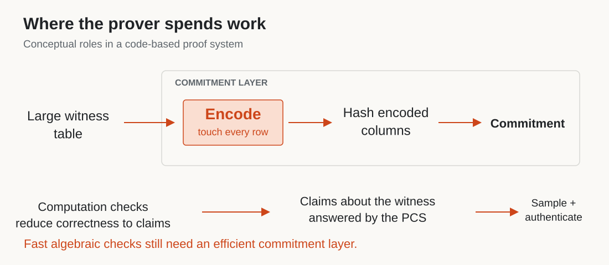
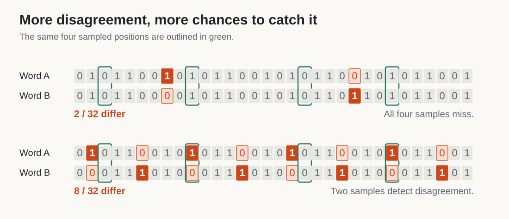
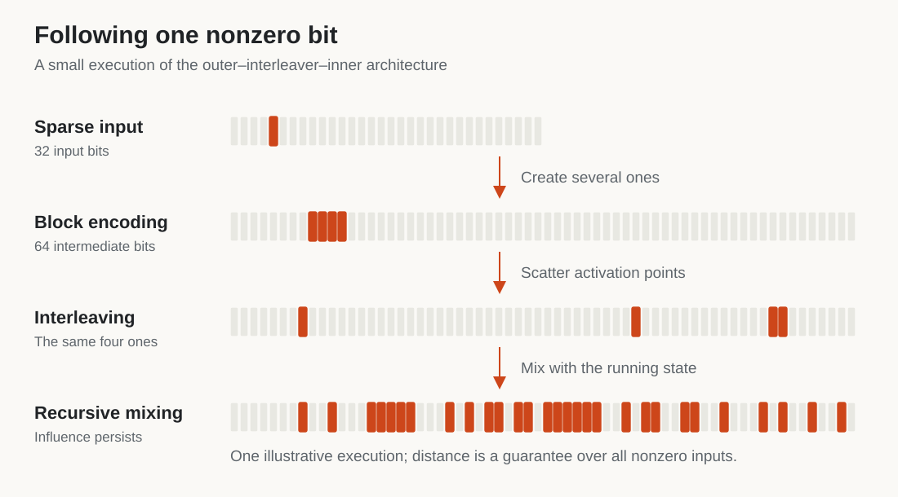
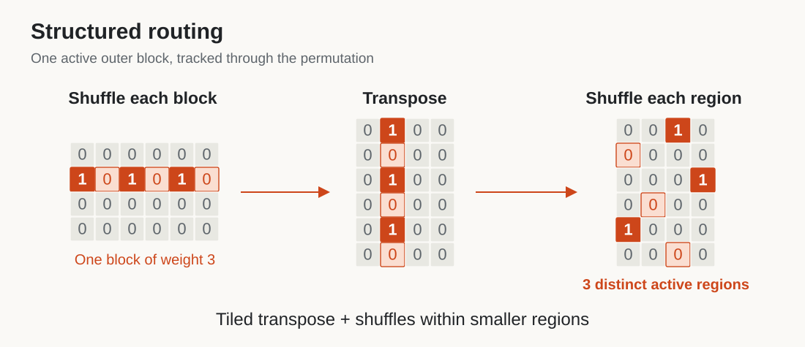
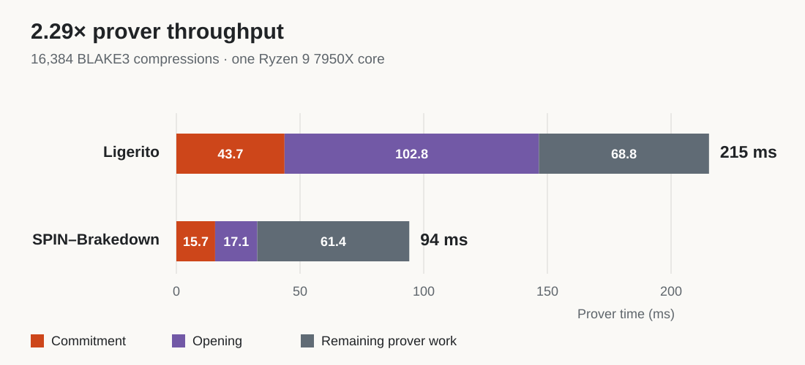

# SPIN: Faster Codes for Faster SNARKs

A SNARK lets one party prove a computation and another check the result without repeating all the work. For a zkVM proving a program's execution, the verifier's job can be small even when the computation is enormous. Producing that proof is the expensive part.

Code-based commitments power many high-performance proof systems. Meanwhile, multilinear protocols have made the algebraic work of proving increasingly efficient. [SP1 Hypercube](https://blog.succinct.xyz/sp1-hypercube/), for example, combines a multilinear proof system with a specialized polynomial commitment scheme to accelerate zkVM proving.

There is a catch: making the algebraic checks linear-time does not automatically make the whole prover linear-time. The commitment scheme may still encode large tables using Reed–Solomon codes. Standard FFT-based encoding takes *O(N log N)* work for *N* symbols, introducing a logarithmic factor into an otherwise linear-time protocol. [HyperPlonk](https://eprint.iacr.org/2022/1355) illustrates how the choice of commitment scheme affects that overall cost.

Linear-time alternatives already exist. [Brakedown](https://eprint.iacr.org/2021/1043) showed how efficiently encodable codes can support a linear-time SNARK prover. But the constants matter: how much arithmetic does each symbol require, how often do we move the data, and how much redundancy do we create?

We introduce **SPIN**, a family of binary linear codes designed around those costs. SPIN combines provable distance with fast encoding and structured memory access. In a FLOCK integration, replacing the polynomial commitment scheme with SPIN–Brakedown reduces proving time for 16,384 BLAKE3 compression instances from **215 ms to 94 ms**, giving **2.29× throughput** on one CPU core. The current integration produces larger proofs; we will return to that tradeoff and a path toward reducing it.

*Figure 1. Encoding processes the full witness inside the commitment layer. Algebraic checks and commitment operations work together throughout the proof; the diagram shows their roles, not the message order.*

## Why a proof system needs a code

Think of the witness as a large table containing the information needed to justify a computation. A **polynomial commitment scheme**, or PCS, lets the prover commit to this table, viewed as a polynomial, and later prove claims about its evaluations. The surrounding proof protocol reduces correctness of the computation to those claims.

In a code-based PCS, the prover first encodes the data into a longer representation. It hashes that representation into a commitment and later supplies selected entries with authentication paths. Encoding is substantial work because it touches the entire table.

What does the redundancy buy us? Any two distinct valid encodings differ in at least a certain number of positions: the code's **minimum distance**. Roughly, the proof protocol uses this separation to force a false claim to create inconsistencies across many positions. The verifier can then detect cheating by sampling a few of them.

The fraction of differing positions matters. If two words disagree in 10% of positions, one uniform sample catches a disagreement with probability 10%. After *q* independent samples, the probability of missing every disagreement is at most 0.9q. This is the sampling intuition; the full protocol also checks consistency with the committed data.

*Figure 2. More disagreements give random samples more opportunities to detect an inconsistency. These are illustrative pairs, not minimum-distance certificates for particular codes.*

We therefore want substantial relative distance without excessive redundancy. A rate-1/2 code doubles the data length. Lowering the rate can help obtain distance, but also gives the prover more data to encode, hash, and store.

Strong distance can be expensive to obtain. A dense generator matrix mixes information thoroughly, but straightforward multiplication does too much work. The design question is: **how can every nonzero input affect a substantial fraction of the output using only a small amount of work per bit?**

## Following one bit through SPIN

SPIN has three stages: a block encoder, an interleaver, and a recursive inner encoder. To see their roles, we will use a simpler version called Random SPIN. The implementation uses structured versions of these operations, which we will describe next.

A sparse input is a useful stress test. Suppose the message is zero everywhere except for one bit. We want the output to contain many ones, despite starting with so little activity.

Why focus on nonzero inputs? SPIN is linear: encoding the XOR of two messages gives the XOR of their encodings. Differences between codewords are themselves codewords. Proving minimum distance therefore amounts to showing that **every nonzero message encodes to a word with many ones**.

*Figure 3. A toy execution of the outer–interleaver–inner architecture. Orange marks ones; pale cells mark zeros. The small example illustrates the mechanism, not the parameters or distance guarantee of the full construction.*

**First, give the active bit some company.** Split the message into small blocks and encode each block separately. Choose outer codes with a useful minimum distance, so even a block with one nonzero input bit produces several nonzero output bits. Our single active block now produces a small cluster of ones. Everything outside that block remains zero.

**Next, scatter the cluster.** The interleaver permutes the outer output. In Random SPIN, this is a uniform random permutation. The cluster becomes several separated opportunities to activate the inner encoder. Scattering also makes it unlikely that all the activity lands near the end, where little output remains to be influenced.

**Finally, keep the influence alive.** The inner encoder processes one bit at a time and remembers several previous outputs. Each new output is the input bit XORed with a randomly selected combination of this state.

While the state is nonzero, independent random feedback coefficients for the next position make its output equally likely to be zero or one. An output one keeps the state active. To return to zero with *m* bits of memory requires *m* consecutive zero outputs. After an output one, that reset has probability 2−m, provided enough positions remain. A later input one can restart the process.

The randomness here belongs to **code setup**. We sample the permutation and feedback coefficients once, then reuse the resulting deterministic encoder for every message.

A low-weight output now requires unfavorable behavior: the state must spend too long inactive, or produce unusually few ones while active. The outer code supplies multiple opportunities to activate it, and the inner makes sustained activity spread through later positions.

Of course, one successful example does not establish minimum distance. The analysis tracks how likely different output weights are, then accounts for all nonzero inputs. If the expected number of low-weight codewords is tiny, the probability that the sampled code contains even one is tiny too. That is how the spreading intuition becomes a guarantee for the whole code.

This construction builds on a long coding lineage. Repeat–accumulate–accumulate codes, used in [Blaze](https://eprint.iacr.org/2024/1609), combine repetition with two interleaved running-XOR stages. [Block-Accumulate codes](https://eprint.iacr.org/2025/1828) use block encoders to strengthen the outer stage. SPIN keeps the block structure and uses a stronger recursive inner after a single interleaver.

## Making the spreading cheap

Random SPIN makes the mechanism easy to explain, but dense random maps are expensive. Structured SPIN changes how the three stages execute, and its distance analysis accounts for those changes.

The outer stage reuses an efficiently encodable constituent code across blocks. We choose it for both its encoding cost and a weight distribution that we can bound. Our finite-length constructions use BCH-derived constituents; the asymptotic family uses a growing BAA constituent with linear encoding work.

The interleaver also has structure. After independently shuffling each outer block, arrange the blocks as rows and transpose them into regions. Then shuffle within each region. Each block contributes exactly one coordinate to each region, so a block of weight *w* reaches *w* distinct regions. The permutation still randomizes positions, but now guarantees a useful form of spreading.

*Figure 4. Orange coordinates belong to one active outer block, including its zero entries. The transpose distributes that block across regions. This structure also permits tiled data movement and smaller shuffles.*

For the inner stage, we process groups of coordinates together. Fixed XOR circuits expand the state into an output group and feed new input back into the state. A cheap random state mixer, sampled once per step at setup, preserves randomness useful to the proof. We share the mixing work across the group instead of evaluating dense random feedback separately at every bit.

These changes reduce both arithmetic and data movement. A second full permutation, a dense matrix multiplication, or another pass over a large buffer can cost more than the XORs themselves.

The resulting asymptotic family has rate 1/2, linear-time encoding, and relative minimum distance above 11% with probability tending to one over setup. For concrete lengths, our BCH-derived configurations certify distance above 10% with setup-failure probability below 2−40 at message lengths 216, 218, 220, 222, and 224. The [SPIN manuscript and implementation](https://github.com/ladnir/spin_codes) provide the constructions and analysis.

## Back to the prover: FLOCK

[FLOCK](https://blog.succinct.xyz/introducing-flock/) proves batches of Boolean computations, including standard cryptographic hash functions. It reduces checks on the computation to claims about a committed witness. That makes it a concrete place to test whether a faster code improves a larger prover.

Our integration replaces FLOCK's Ligerito PCS with SPIN–Brakedown. The commitment arranges the witness into rows, encodes each row, and hashes the encoded columns. Opening a claim involves combinations of the rows and authenticated column queries.

Linearity connects those operations: encoding a combination of message rows gives the same result as combining their encodings. The verifier uses this relation to check the sampled columns against the claimed combinations.

Getting the code into the protocol requires some engineering. FLOCK requests weighted claims about witness coordinates; the adapter incorporates those weights into the PCS's row combinations. We keep the witness packed, avoiding the cost of expanding every bit into a larger field element or repeatedly repacking the data.

At **16,384 BLAKE3 compression instances**, total prover time falls from **215 ms to 94 ms**, giving **2.29× throughput**, or about 56% less proving time.

*Figure 5. Prover time on one Ryzen 9 7950X core at 4.5 GHz, with boost disabled. Both backends receive the applicable shared prover optimizations. Components use unrounded measurements; labels round independently.*

The breakdown explains the improvement. Commitment falls from 43.7 ms to 15.7 ms, and opening from 102.8 ms to 17.1 ms. Together, those stages save about 114 ms of the 121 ms total reduction. Encoding itself falls from 26.9 ms to 7.9 ms. Hashing remains a substantial part of commitment, so its cost also matters. The integration avoids encoding whole rows of padding zeros and writes the witness directly in the layout the PCS needs. These measurements compare complete PCS integrations, including their layouts and opening algorithms, rather than isolating an encoder-only substitution.

| BLAKE3 compressions | Ligerito prover | SPIN–Brakedown prover | Throughput improvement |
|---|---:|---:|---:|
| **16,384** | **215 ms** | **94 ms** | **2.29×** |
| 65,536 | 571 ms | 351 ms | 1.63× |

At the larger workload, SPIN–Brakedown's commitment and opening take 108 ms, up from 33 ms for four times as much data. Their cost per unit of data improves. The surrounding prover now takes 243 ms, about 69% of the total, making constraint checking and witness generation the next optimization targets. Ligerito's opening cost also scales favorably between these workloads, contributing to the smaller relative speedup.

The experiments prove batches of BLAKE3 compression constraints on one core. Prover time includes witness generation, commitment, and proving; it excludes setup, verification, and outer proof serialization. Both backends run in the same optimized implementation. These September 2026 measurements include the latest implementation optimizations; they are separate from the earlier paper measurements. We average two process medians, each using four proofs after five warmup and settling proofs. All 108 proofs generated in the comparison, including the previous-integration baseline, verified. Binding public hash inputs and outputs is a separate application wrapper. Exact timings are in the [measurement data](performance.json); the manuscript documents the [protocol and security accounting](../../paper/flock.tex).

There is a communication tradeoff. At 16,384 compressions, the SPIN–Brakedown proof is **6.2 MiB**, compared with **0.3 MiB** for Ligerito. Verification takes **37 ms versus 28 ms**. The current integration favors prover computation, which can be the limiting resource when generating many proofs. Applications must also account for the cost of transmitting and checking them.

## Make it fast, then make it small

The large proofs come partly from the simple Brakedown-style opening, which explicitly sends combined witness rows. This is a choice of commitment construction, rather than an unavoidable consequence of SPIN's code.

**Code switching**, as used in [Blaze](https://eprint.iacr.org/2024/1609), offers a route to smaller proofs. The idea is to use an efficient code for the large witness, then transfer the remaining checks to proof machinery with compact proofs. Blaze's framework combines the encoding efficiency of one code with the verification properties of another proof system.

Combining SPIN with that framework is a natural next step. We have not implemented that combination, so its concrete speed–size tradeoff remains to be measured. The FLOCK experiment establishes the performance of the current integration and identifies where further work can help.

The broader objective is a prover whose encoding keeps pace with its algebraic checks. SPIN brings provable distance and efficient memory access into the same design. The next step is to retain that speed while reducing what the prover has to send.

The [SPIN encoder is available on GitHub](https://github.com/ladnir/spin_codes), together with the manuscript and supporting material.
