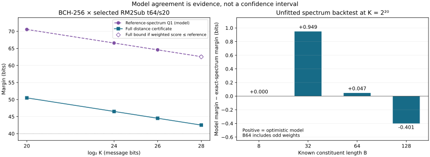

# A spectrum-aware curve for BCH-256

The current evidence supports a useful planning curve, but not a single
unqualified security estimate. The known-spectrum backtests are encouraging:
the reference model overstates Q1 margin by at most 0.949 bits in the tested
cases. At BCH-256, the unconditional distance certificate remains about
42.51 bits at K=2^28. An explicit reference-score assumption gives a
62.52-bit conditional bound at that same endpoint.

## What the curve models

Keep the selected t64/s20 RM2Sub map, independent permutations, and fresh
nonzero field multipliers from `K28_DISTANCE_CERTIFICATE.md`. The model
comparisons use cutoff floor(2K/10). The historical K20 full certificate
retains its slightly stronger cutoff, 209716. All points use the selected
map; the different nested map in the landscape study is not substituted.

For an outer constituent of length B and dimension D=B/2, there are
L=K/D outer rows. Q1 counts bad messages with exactly one nonzero row.
Its first-moment bound has the form

\[
U_1=L\sum_{w>0}A_w p_w,\qquad
M_1=-\log_2 U_1,\qquad C_B=M_1+\log_2 L.
\]

Here A_w is the number of outer words of weight w, and p_w is a transfer
upper bound for one such word after the random routing and inner encoding.
The adjusted margin C_B removes the explicit number of row locations.

The reference assigns binomial mass to the weights permitted by minimum
distance, parity, and the all-one/complement property. It reserves one zero
word and, when that property applies, one all-one word. Remaining mass is
normalized to the constituent dimension. These rational reference counts
are a surrogate, not necessarily a realizable weight enumerator.

For the shortened BCH-64 constituent, the reference retains odd weights
and does not reserve an all-one word. It does not use the exact upper
support endpoint to improve its prediction. Applying an even-only model
to this constituent would be an invalid comparison.

## Backtest with known spectra, not a fit through unknown BCH-256

`curve_spectrum_calibration.py` recomputes both exact-spectrum and reference
Q1 bounds using the same selected inner map and matched tilt witnesses.
It tests K=2^16, 2^20, 2^24, and 2^28 for each known constituent. Numerical
transfer evaluation is binary64; these are not new full-distance certificates.

At K=2^20:

| Constituent | Reference Q1 margin | Exact-spectrum Q1 margin | Model overstatement |
|---|---:|---:|---:|
| BCH [8,4,4] | 2.545 | 2.545 | 0.000 bits |
| BCH [32,16,8] | 5.972 | 5.023 | +0.949 bits |
| Shortened BCH [64,32,12] | 10.434 | 10.387 | +0.047 bits |
| BCH [128,64,22] | 32.368 | 32.770 | -0.401 bits |

Positive overstatement means the model predicts too much margin.
Across all 16 cases, the largest overstatement is below one bit.
The model parameters were not fitted to these weighted errors. BCH-8 is
effectively a normalization check, since its reference equals its spectrum.
Repeated message lengths do not supply independent constituent samples.

This backtest supports the reference as a starting point, not a one-bit
error guarantee for BCH-256. Only a few constituents are available, and
BCH-64 is shortened rather than a matching extended-BCH rung.

The relevant diagnostic is a weighted error, not merely the ratio of
minimum-shell counts. Define

\[
b_{B,K}:=\log_2\frac{\sum_w A_w p_w}
                            {\sum_w\widehat A_w p_w}.
\]

Then b_(B,K) equals the reference margin minus the exact-spectrum margin
when the same coefficients are used. This functional is the quantity a
calibrated estimator should try to control.

## Separate message growth from constituent growth

For fixed BCH-256, the reference Q1 curve is

| log2 K | Reference Q1 margin |
|---:|---:|
| 16 | 74.216811 bits |
| 20 | 70.554413 bits |
| 24 | 66.575720 bits |
| 28 | 62.577055 bits |

At the tested points from exponents 20 through 28, the planning expression
M1 approximately 90.58-log2(K) is close. The shorter point shows a larger
finite-epoch correction. This is a diagnostic local trend, not a uniform
bound over every message length. The fully certified points also lose
approximately one bit per doubling, but sit about 20 bits lower.

Constituent growth is a different question. At K=2^28, linearly extending
C_B from the exact BCH-64 and BCH-128 points predicts C_256=89.560730 bits.
The structure-aware BCH-256 reference instead gives 83.577055 bits, almost
six bits lower. Neither is the known true BCH-256 value. Their disagreement
shows why a straight line through two constituent sizes is not a robust
estimator, even when message-length slopes appear stable.

Prefer a model of the admissible low shells and their transfer costs over
an unconstrained fit in B. This note does not predict spectra beyond B=256.

## Remove the rounding obstruction at the certified endpoint

The earlier receipts assigned 2^-80 to each dense occupancy. Summing roughly
two million such entries limited the retained higher-occupancy margin to
58.999649 bits. That was a storage choice, not evidence that dense messages
dominate actual failure.

`frontier_dense_retain.py` reuses each frozen dense interval tree and its
auxiliary probabilities. It recomputes all leaf bounds and subdivides any
leaf that does not meet the tighter 2^-100 per-occupancy budget. The four
new trees contain 3050, 7991, 331, and 890 leaves. All passed 512-bit replay.
No sparse witness discovery or sparse probability substitution was needed.

The exact aggregate ledger is `generated/curve_k28_full_retained_v1.json`.
It retains the old, replayed Q1 and sparse receipts. The new higher-occupancy
margin is 67.29977831921113 bits. The unconditional full margin improves
only slightly, to 42.51002841627769 bits. All occupancies remain covered.

## An explicit conditional statement

Fix the actual BCH-256 constituent C and the saved outward Q1 coefficients
c_w in `generated/frontier_k28_q1_v1.json`. Each coefficient includes the
row factor L. Put

\[
S(C):=\sum_{w>0}A_w(C)c_w,\qquad
S_{\rm ref}:=\sum_{w>0}\widehat A_w c_w.
\]

Let U_h be the retained, unconditional first-moment upper bound for all
higher occupancies of this fixed construction. For a selected nonnegative
integer b, state the deterministic hypothesis

\[
\mathsf H_b:\quad S(C)\le 2^b S_{\rm ref}.
\]

If H_b holds, the probability over the encoder setup theta satisfies

\[
\Pr_\theta[\exists x\ne0:\operatorname{wt}(E_\theta(x))
                    \le\lfloor2K/10\rfloor]
\le 2^bS_{\rm ref}+U_h.
\]

Indeed, the Q1 first moment is at most S(C), the higher-occupancy first
moment is at most U_h, and their sum bounds the existence event. No new
probability distribution on C is introduced. In particular, H_b is not a
claim that every individual shell is below its reference count.

The reference score and U_h are stored as exact rational numbers. Their
conditional union gives:

| Weighted-score assumption | Conditional full margin at K=2^28 |
|---|---:|
| H0: no inflation | 62.523438 bits |
| H1: at most 2 times reference | 61.550003 bits |
| H2: at most 4 times reference | 60.563472 bits |
| H4: at most 16 times reference | 58.573656 bits |
| H8: at most 256 times reference | 54.576854 bits |

These are conditional bounds, not confidence intervals or additional
unconditional certified bits. A fourfold scenario is more conservative
than the observed backtest errors, but that observation does not prove H2.

The reference Q1 score from the saved outward witnesses has margin
62.577067030904686 bits. At b=0, adding U_h costs only 0.053629013100246
bits. This isolates the main remaining uncertainty in the spectrum score.
The nearby 62.577055-bit diagnostic uses a different finite witness set;
it is not substituted for the exact rational score.

## What existing BCH-256 evidence does and does not support

Weights 38 and 40 supply about 99.28 percent of the reference Q1 score
in the K=2^20 diagnostic. They are the highest-value targets for improving
the estimator. The same application-weighted comparison should be used
when deciding how much new shell evidence is sufficient.

The existing `SPIN_HEURISTIC_EVIDENCE.md` and
`LOCATOR_INCIDENCE_DUAL_TRACK.md` provide relevant but weaker evidence:

- Enumerated codewords and affine orbits give lower bounds on shell counts;
  they do not estimate completeness or upper-bound unseen words.
- Incidence sampling tests a specific lower-order statistic. Its
  random-like behavior does not establish a factor-four weighted-spectrum
  bound. Existing incidence upper-count implications are much looser than
  that target.
- The known q=128 fully split locator endpoint is strongly enriched
  relative to its independent-root reference. Therefore a broad
  independent-splitting model should not be used as justification. That
  is a different reference from the conditioned outer-spectrum model
  tested here; the two must not be conflated.

The application corrections at the top of those older documents remain
important: a weight-38 allocation alone was not a joint low-shell closure.
This assessment uses the current RM2Sub coefficients and complete higher
coverage, not the old RandomStepConv application thresholds.

## Estimator use and next step

Keep three outputs separate: unconditional certified margin; reference
Q1 curve; and assumption-dependent full margin where higher occupancies
have been checked. At present the last calculation above is checked at
K=2^28, not across the entire displayed curve. Do not label the remaining
Q1 points as full modeled margins.

Next, carry the retained higher-occupancy analysis to the practical smaller
K points, and expose b as an explicit sensitivity input. Use the dominant
weighted score to prioritize additional BCH-256 evidence. This should give
the estimator a useful planning curve without silently converting a small
backtest into a confidence claim.

The generated analysis is `generated/curve_spectrum_calibration_v1.json`.
It hashes the spectra, selected map, transfer sources, and endpoint ledger.
All 33 selected regression tests pass, including exact conditional-score
reconstruction and dense-tree budget checks. The static figure was visually
checked. Frozen earlier receipts and the other workstream are unchanged.

For reproduction, use fresh output paths and run numerical jobs sequentially.
For each of the four K28 dense receipts, run `frontier_dense_retain.py
--source <old-receipt> --bits 100 --output <new-receipt>`, then replay with
`--verify --output <new-receipt>`. Aggregate these with the frozen Q1 and
two sparse receipts using `frontier_ledger.py`. The calibration driver is
`curve_spectrum_calibration.py --output <new-analysis>`; its endpoint inputs
are the retained ledger and frozen Q1 receipt named above. Regenerate the
figure with `plot_curve_spectrum.py --directory <fresh-directory>`.
